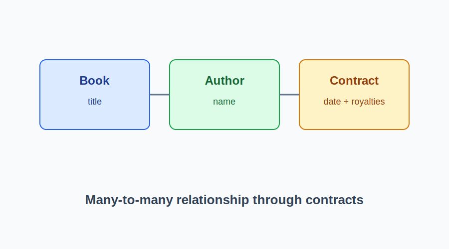

# Many-to-many Book and Author Contracts Lab

This project models a many-to-many relationship between books and authors using contracts as the join table. Authors can sign agreements for multiple books, and each book can have multiple contributing authors.

## What the model includes

- A Book class with a title and relationship helpers for contracts and authors
- An Author class with relationship helpers for contracts and books
- A Contract class that validates its data and stores the agreement details
- Helper methods to create contracts and summarize royalties

## Example workflow

```python
from many_to_many import Author, Book, Contract

author = Author("Ada Lovelace")
book = Book("The First Algorithm")

author.sign_contract(book, "01/01/2026", 50000)

print(author.books())
print(book.authors())
print(author.total_royalties())
```

## Project snapshot



## Notes

- The implementation uses class-level registries so each created object can be inspected later through the related methods.
- Contracts validate their inputs to ensure the author, book, date, and royalties all match the expected types.
- The code is documented with short docstrings to make the purpose of each class and method clearer.
